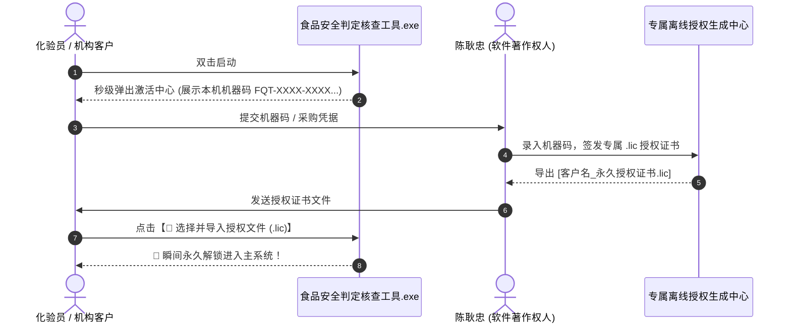

# 🛡️ 食品安全国家标准判定核查与实验室质控数字化工作台
### Food Safety Standards Compliance & Lab Quality Control Suite

  
  
  
  

---

## 📖 项目简介 (Overview)

**《食品安全国家标准判定核查与实验室质控数字化工作台》** 是一款面向**第三方食品检验检测机构、海关农残理化实验室、食品生产企业 QA/QC 部门及认证审核员**打造的专业级桌面数字化生产力工具。

本系统由 **国家注册审核员（ISO 22000 / HACCP）/ 实验室理化质控专家 陈耿忠** 结合多年一线实验室文控、方法验证（GB/T 27404-2026）、CNAS/CMA 资质评审及标准查新实战经验倾力研发。

> **💡 核心设计理念**：
> 1. **全景数据内置**：收录 6 大核心国家标准现行有效限量共计 **83,973 条**，纯离线秒级检索；
> 2. **极致生产力**：从传统的“翻纸质标准/查PDF表格”进化为“Excel 批量导入 ➔ 表头自适应 ➔ 毫秒级多项目合规判定”；
> 3. **合规严谨性**：内置添加剂比例之和、致病菌三级采样规则、脱水折算系数及计量期间核查算法。

---

## 🏛️ 权威国家标准数据库覆盖 (83,973 条现行限量)

系统深度整合了食品检测领域全部主流通用安全标准（全量内置入独立程序，无须联网）：

| 序号 | 国家标准代号 | 权威标准全称 | 限量数据条数 | 涵盖核心检测维度 |
| :---: | :--- | :--- | :---: | :--- |
| 1 | **GB 2760-2024** | 《食品安全国家标准 食品添加剂使用标准》 | **32,937 条** | 2024新版：脱氢乙酸全面禁用、甜味剂与防腐剂使用限量 |
| 2 | **GB 2763-2026** | 《食品安全国家标准 食品中农药最大残留限量》 | **48,878 条** | 蔬菜、水果、粮食、茶叶、坚果全品类农药 MRL 限量 |
| 3 | **GB 31650-2019** | 《食品安全国家标准 食品中兽药最大残留限量》 | **1,531 条** | 畜禽肉、水产品、鲜蛋、生乳之抗生素、瘦肉精、违禁兽药 |
| 4 | **GB 2762-2025** | 《食品安全国家标准 食品中污染物限量》 | **293 条** | 铅、镉、总汞、砷、铬、苯并[a]芘、亚硝酸盐限量 |
| 5 | **GB 29921-2021** | 《食品安全国家标准 预包装食品中致病菌限量》 | **239 条** | 沙门氏菌、单增李斯特菌、金葡菌等三级采样方案 ($n,c,m,M$) |
| 6 | **GB 2761-2017** | 《食品安全国家标准 食品中真菌毒素限量》 | **95 条** | 黄曲霉毒素B1/M1、脱氧雪腐镰刀菌烯醇(DON)、展青霉素 |

---

## 🚀 八大核心功能矩阵 (Key Features)

### 1️⃣ 宽幅样品类别智能检索与合规判定
* 采用大宽度、高清晰度的 **样品/食品类别智能下拉菜单 (Combobox)**；
* 支持按“标准名称”、“食品类别/原料”、“检测项目/添加剂”即时多条件联合过滤；
* 录入实验室实测值（支持一键填入“ND / 0”），瞬间输出【✅ 合格】或【❌ 不合格】结论与法律法规条款依据。

### 2️⃣ 多项目 Excel 批量导入与表头自适应核查
* 支持直接导入化验室日常检测台账与 LIMS 导出的 Excel / CSV 表格；
* **表头智能筛选与列宽记忆**：自适应对齐“样品名称”、“检测项目”、“实测浓度”，一键完成全批次判定并导出着色高亮分析报告。

### 3️⃣ GB 2760 食品添加剂同一功能复配比例之和智能计算器
* 严格遵循 GB 2760-2024 第 4.4 条规范：
  $$\sum \frac{\text{实测值}_i}{\text{最大允许限量}_i} \le 1.0$$
* 自动匹配防腐剂组（脱氢乙酸+山梨酸+苯甲酸）、着色剂组（柠檬黄+日落黄）、抗氧化剂组（TBHQ+BHA+BHT），图形化渲染比例占用堆叠图。

### 4️⃣ 微生物致病菌三级采样规则判定引擎
* 内置预包装食品 GB 29921 / GB 31607 采样方案：
  $$\text{判定合规条件：} \quad c \le c_{\text{max}} \quad \text{且} \quad \forall x_i \le M \quad \text{且} \quad (m < x_i \le M) \le c$$

### 5️⃣ GB 2762 脱水干制品与浓缩系数折算换算器
* 针对干食用菌、脱水蔬菜、浓缩果汁、乳粉等制品，依据水分含量与浓缩比自动反推原鲜品限量，杜绝误判漏判。

### 6️⃣ GB/T 27404-2026 实验室理化质控分析系统
* 涵盖空白试验、平行双样精密度 (RSD)、基质加标回收率计算、Shewhart / Westgard 质控图与质控预警分析。

### 7️⃣ 能力验证与盲样考核数据统计预评系统 (ISO 13528 / CNAS-GL002)
* 提供 Algorithm A 稳健均值与稳健标准差、Grubbs / Dixon 离群值检验、Z-Score / En-Value 评分与雷达图评估。

### 8️⃣ 实验室仪器计量校准确认与期间核查管理系统 (ISO 17025)
* 覆盖色谱仪、质谱仪、原子吸收、天平等仪器检定/校准证书确认（MPEV 最大允许误差比对）与核查计划调度。

---

## 📥 软件下载与运行指南 (Download & Installation)

本工作台采用独立单文件绿色免安装打包，**无需安装 Python 环境，开箱即用**：

1. 前往本项目的 **[Releases 发布页面](../../releases)**；
2. 下载最新版本的 `食品安全标准判定核查工具(完整版)_批量表头筛选.exe` 或 `食品安全标准判定核查工具(纯净版)V1.0.exe`；
3. 双击直接运行。

---

## 🔒 离线“一机一码”授权机制 (Offline Licensing)

为保障专业知识产权与合规交付安全，本软件采用纯离线 **HMAC-SHA256 硬件指纹加密绑定机制**：

---

## 👨‍🔬 软件作者与技术咨询 (Author & Contact)

* **作者**：**陈耿忠**
* **专业资质**：
  * CCAA 国家注册审核员（ISO 22000 / HACCP）
  * 食品理化与农残残留分析高级技术专家
  * 实验室资质认定（CMA / CATL / CNAS ISO 17025）技术骨干
* **应用单位**：深圳海吉星 FQT 农产品检测认证有限公司 / 凯吉星 / 中鼎
* **商务合作与技术咨询**：如需定制实验室文控系统、方法扩项支持或获取永久企业授权，请通过 GitHub Issue 或私信联系。

---

## ⚖️ 版权与免责声明 (Copyright & License)

* 本软件著作权归 **陈耿忠** 所有，受中华人民共和国著作权法及国际版权公约保护；
* 软件内置的标准数据均来源于国家卫生健康委员会、国家市场监督管理总局及农业农村部公开发布之国家食品安全强制性标准文本；
* 未经著作权人书面授权，严禁对本软件进行反编译、破解、脱壳或用于商业倒卖。

<b>© 2026 Powered by 陈耿忠. All Rights Reserved.</b>

